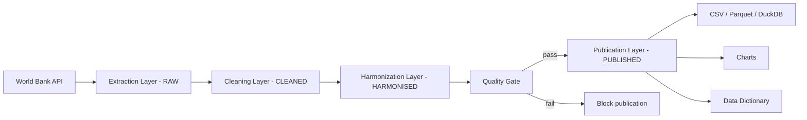
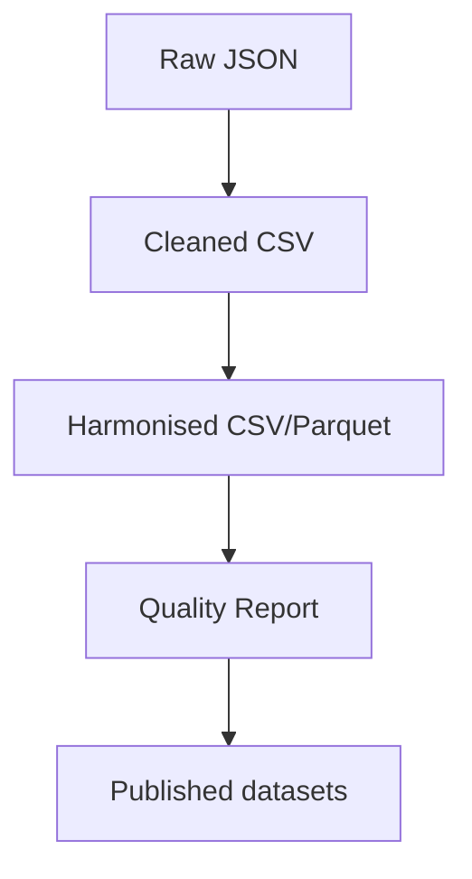
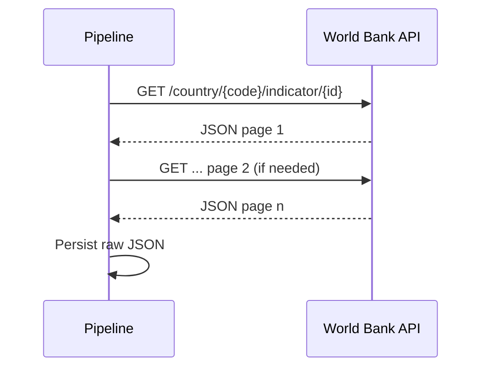
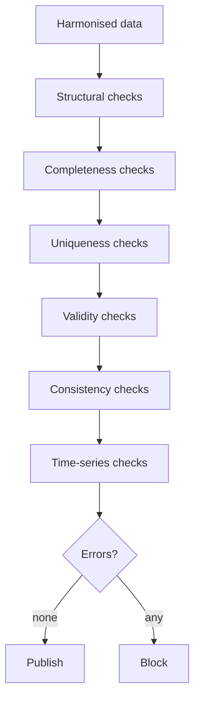
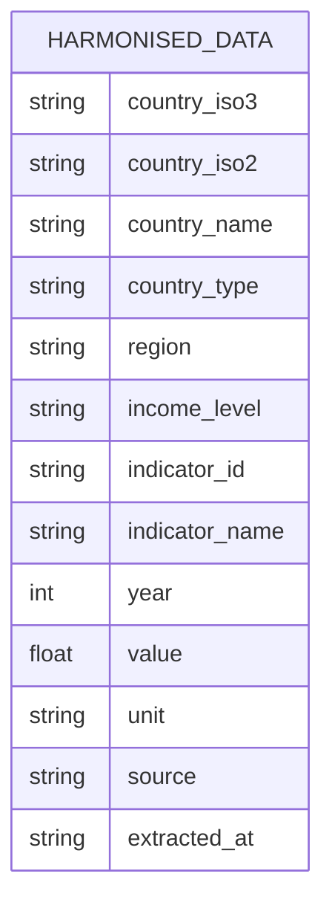
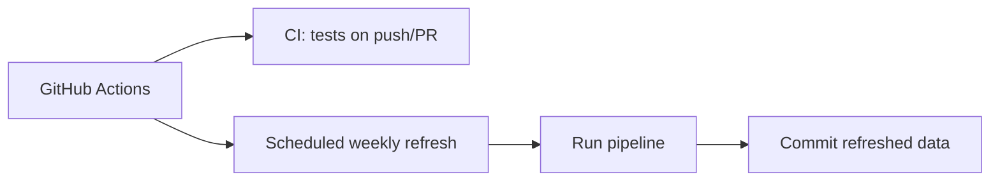

# Architecture

## High-level architecture

```mermaid
flowchart LR
    A[World Bank API] --> B[Extraction Layer - RAW]
    B --> C[Cleaning Layer - CLEANED]
    C --> D[Harmonization Layer - HARMONISED]
    D --> E[Quality Gate]
    E -->|pass| F[Publication Layer - PUBLISHED]
    E -->|fail| G[Block publication]
    F --> H[CSV / Parquet / DuckDB]
    F --> I[Charts]
    F --> J[Data Dictionary]
```

## Data lifecycle

```mermaid
flowchart TD
    R[Raw JSON] --> C[Cleaned CSV]
    C --> H[Harmonised CSV/Parquet]
    H --> Q[Quality Report]
    Q --> P[Published datasets]
```

## API ingestion workflow

```mermaid
sequenceDiagram
    participant P as Pipeline
    participant API as World Bank API
    P->>API: GET /country/{code}/indicator/{id}
    API-->>P: JSON page 1
    P->>API: GET ... page 2 (if needed)
    API-->>P: JSON page n
    P->>P: Persist raw JSON
```

## Quality validation workflow

```mermaid
flowchart TD
    D[Harmonised data] --> S[Structural checks]
    S --> C[Completeness checks]
    C --> U[Uniqueness checks]
    U --> V[Validity checks]
    V --> CS[Consistency checks]
    CS --> T[Time-series checks]
    T --> G{Errors?}
    G -->|none| P[Publish]
    G -->|any| B[Block]
```

## Analytical data model

```mermaid
erDiagram
    HARMONISED_DATA {
        string country_iso3
        string country_iso2
        string country_name
        string country_type
        string region
        string income_level
        string indicator_id
        string indicator_name
        int year
        float value
        string unit
        string source
        string extracted_at
    }
```

## Automation workflow

```mermaid
flowchart LR
    GH[GitHub Actions] --> CI[CI: tests on push/PR]
    GH --> SCH[Scheduled weekly refresh]
    SCH --> RUN[Run pipeline]
    RUN --> PUB[Commit refreshed data]
```
